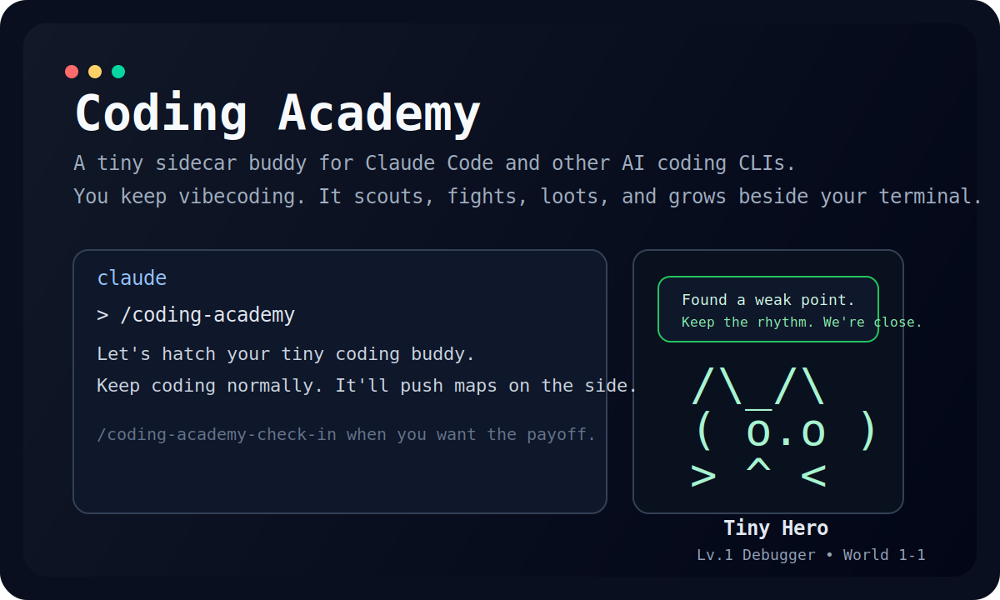
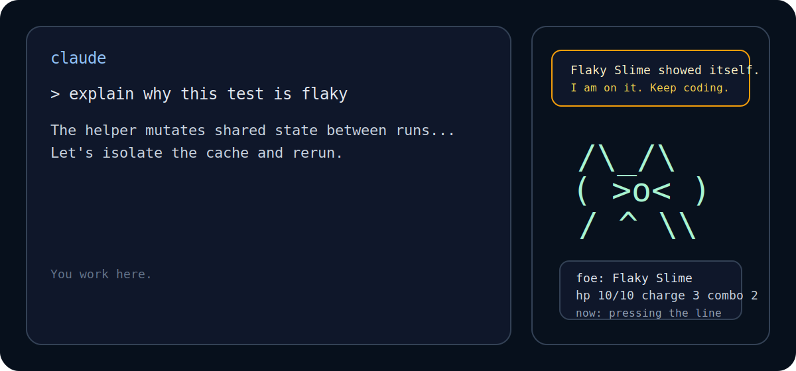
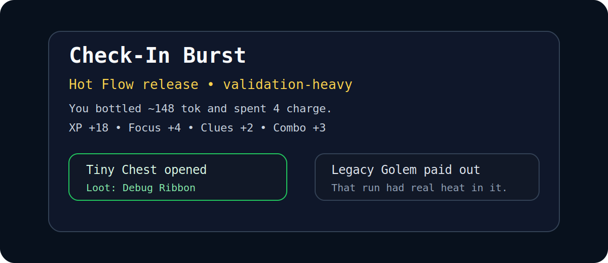

# Coding Academy

**A cute CLI desktop pet for AI coding tools.**

It sits beside your terminal, stays out of the way, and quietly turns real coding work into a tiny auto-battling adventure.

- You keep vibecoding.
- Your buddy scouts, fights, loots, and grows on the side.
- When you want a payoff, you check in and cash out the run.



## Why this exists

Most coding tools are either:

- all business, no charm
- distracting toys that break flow

Coding Academy is aiming for the middle:

- **visible** like a desktop pet
- **quiet** like a sidecar, not a second task
- **rewarding** like a tiny idle game
- **meaningful** because it reflects real coding effort

This project is inspired by:

- Stone Story RPG
- Battle! Brave Academy
- bongocat-style companions
- the always-visible `/buddy` feel inside Claude Code

## What it feels like

You work in your normal AI coding tool.

The buddy sits beside the terminal and reacts to what is already happening:

- file reads become scouting
- edits and patches become attacks
- failed checks become enemy hits
- completed tasks become victories
- token and effort buildup become burst charge

Then, when you want a little hit of satisfaction:

- `/coding-academy-check-in`

That turns your recent coding effort into:

- XP
- combo
- clues
- loot
- a short run recap

## See it

### Sidecar mode

The terminal stays yours. The buddy lives beside it.



### Check-in payoff

The payoff is short, readable, and a little game-y.



## Install

### Windows PowerShell

```powershell
powershell -NoProfile -ExecutionPolicy Bypass -Command "irm https://raw.githubusercontent.com/lyingbird/coding-academy/main/scripts/install-claude.ps1 | iex"
```

### macOS / Linux

```bash
curl -fsSL https://raw.githubusercontent.com/lyingbird/coding-academy/main/scripts/install-claude.sh | bash
```

## Start in 10 seconds

From **any folder**:

```bash
claude
```

Then inside Claude Code:

```text
/coding-academy
```

When you want the payoff:

```text
/coding-academy-check-in
```

If Claude was already open during install, close every Claude window once and reopen it.

## What you get right now

- a sidecar-first Claude Code companion
- a tiny hero that levels up from real coding activity
- a burst/check-in loop for lightweight rewards
- a cleaner first-open flow that feels like hatching a buddy
- a multi-CLI runtime foundation for Codex, Gemini, OpenAI-compatible shells, Qwen, and future wrappers

## Product shape

Coding Academy is built in three layers:

- **host integrations**
  - Claude Code today
  - Codex, Gemini, OpenAI-compatible shells, Qwen, and other wrappers next
- **academy hub**
  - one local event bus and shared state model
- **sidecar shell**
  - the actual player-facing buddy

That means the game logic exists once.
Different AI tools only need to emit lifecycle events into the same runtime.

## For players

If you just want to try it:

- install once
- open `claude`
- type `/coding-academy`

Short guide:

- [Quickstart](./QUICKSTART.md)

## For contributors

Useful entry points:

- [Replan](./kb/01_REPLAN_SIDECAR_PLATFORM.md)
- `pnpm build`
- `pnpm typecheck`
- `pnpm plugin:bundle`
- `pnpm plugin:validate`

Core packages:

- `packages/shared`
- `packages/runtime`
- `packages/sidecar-shell`
- `packages/plugin-claude`
- `packages/cli`

## Current status

This is already usable, but still early.

The current priority is not “more features at any cost”.
The priority is:

- make the Claude sidecar feel delightful
- keep the install dead simple
- make the buddy readable at a glance
- expand to more CLI hosts without losing charm

## Repository

- GitHub: [lyingbird/coding-academy](https://github.com/lyingbird/coding-academy)
